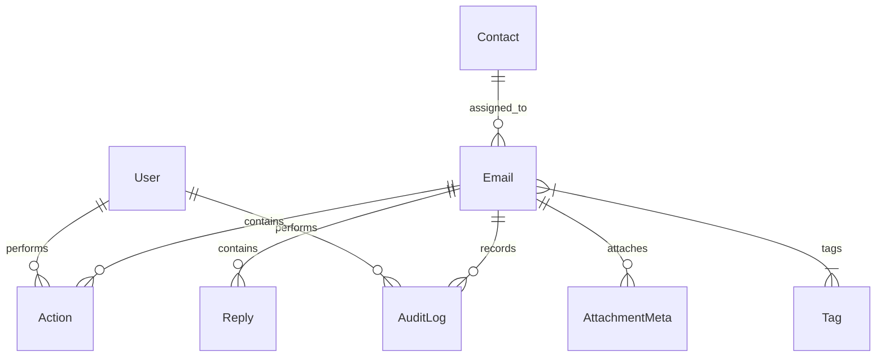

# Manager Email Tracker

A production-ready web application built to help company managers filter, track, assign, and triage high-volume emails. Designed with a clean, responsive dark-mode dashboard interface, granular search capabilities, a complete history audit trail, a contacts directory, and instant CSV exports.

---

## Core Features

- **Executive KPI Dashboard**: Metrics monitoring **Needs Action**, **Waiting Reply**, **Forwarded**, **Closed**, and **Overdue** items.
- **Triage Queue**: A detailed chronological summary table highlighting email priorities (High, Medium, Low), dates, sender details, status badges, and overdue status alerts.
- **Advanced Filtering & Search**: Refine inboxes instantly by keyword (subject, sender, company, body text), status, priority, specific assignee, or tag.
- **Dynamic Action Workspace**:
  - Log internal follow-up **Notes**.
  - Log external **Replies** received (automatically resets status to *Needs Action* to alert the manager).
  - **Assign/Forward** emails to employees, departments, or vendors (automatically updates status to *Forwarded*).
  - Update email **Status** directly.
- **Chronological Auditing**: A complete audit trail tracking who made modifications, when reassignment occurred, and status transitions.
- **Contacts Directory**: Separate directory sheets for internal team Employees, Vendors/Partners, and Client accounts.
- **CSV Data Export**: Instant download endpoint generating clean spreadsheet exports of inbox records.
- **Sync webhooks placeholder**: Built-in architecture endpoints to link Gmail API push notifications or Microsoft Graph webhook triggers later.

---

## Technical Stack

- **Framework**: Next.js 14+ (App Router) with TypeScript
- **Styling**: Vanilla CSS (Global Styles + CSS Modules) — default dark mode theme using high-contrast deep obsidian and slate panels.
- **ORM & Database**: Prisma ORM v7 with PostgreSQL compatibility.
- **API / Mutations**: React Server Actions for structured mutations, and server-side loading for maximum speed.
- **Deployment**: Vercel.

---

## Folder Structure

```
manager-email-tracker/
├── prisma/
│   ├── schema.prisma (PostgreSQL Database Schema & Indices)
│   ├── seed.ts       (Rich database seed data script)
│   └── migrations/   (Generated database SQL migrations)
├── src/
│   ├── app/
│   │   ├── layout.tsx                (Global App Router wrapper)
│   │   ├── page.tsx                  (Dashboard panel metrics)
│   │   ├── emails/
│   │   │   ├── page.tsx              (Advanced search, filter & queue table)
│   │   │   ├── actions.ts            (Server Actions for email mutations)
│   │   │   ├── new/
│   │   │   │   ├── page.tsx          (New email page loader)
│   │   │   │   └── NewEmailForm.tsx  (Manual email insertion client form)
│   │   │   └── [id]/
│   │   │       ├── page.tsx          (Email details layout, timelines & logs)
│   │   │       └── TriagePanel.tsx   (Action workspace tab controller)
│   │   ├── contacts/
│   │   │   ├── page.tsx              (Contact directory sheets)
│   │   │   ├── actions.ts            (Server Actions for contact CRUD)
│   │   │   └── ContactForm.tsx       (Contact adder panel)
│   │   ├── reports/
│   │   │   └── page.tsx              (Aggregate metric bars & download CSV triggers)
│   │   ├── settings/
│   │   │   └── page.tsx              (Simulated auth specs & OAuth hook guides)
│   │   └── api/
│   │       ├── export/
│   │       │   └── route.ts          (CSV downloader API endpoint)
│   │       └── sync-placeholder/
│   │           └── route.ts          (Webhook integration stub)
│   ├── components/
│   │   ├── Sidebar.tsx               (Navigation & Profile footer)
│   │   ├── Header.tsx                (Global search form & warning bar)
│   │   ├── KPICards.tsx              (Executive dashboard metric cards)
│   │   ├── EmailTable.tsx            (Queue table list display)
│   │   └── StatusBadge.tsx           (Color-coded status & priority tags)
│   ├── lib/
│   │   ├── db.ts                     (Prisma client singleton helper)
│   │   └── utils.ts                  (Formatting & CSV generator helpers)
│   └── styles/
│       ├── globals.css               (Base variables, dark layout & core inputs)
│       ├── layout.module.css         (Navigation sidebar & header layout grid)
│       └── components.module.css     (KPIs, Timelines, Cards, and directory tables)
├── package.json
├── tsconfig.json
├── .env.example                      (Environment variables structure)
└── README.md
```

---

## Local Setup Instructions

### 1. Clone & Install Dependencies
Navigate to your project folder and run:
```bash
npm install
```

### 2. Configure Database connection URL
Create a copy of `.env.example` named `.env`:
```bash
cp .env.example .env
```
Open the `.env` file and replace the `DATABASE_URL` placeholder string with your live PostgreSQL connection string. 

> [!TIP]
> You can create a free PostgreSQL database in under 2 minutes on [Neon.tech](https://neon.tech), [Supabase](https://supabase.com), or [Aiven](https://aiven.io). Ensure your connection URL contains the `sslmode=require` query parameter if hosting on Neon/Supabase.

### 3. Initialize & Seed Database
Build the database tables, relations, and indices from the Prisma schema:
```bash
npx prisma db push
```

Run the seed script to populate the database with realistic demo emails, tags, and contacts:
```bash
npx prisma db seed
```

### 4. Run Development Server
Start the dev server:
```bash
npm run dev
```
Open [http://localhost:3000](http://localhost:3000) in your browser.

---

## Deployment to Vercel (Production)

### 1. Prepare GitHub Repository
Create a new **private** GitHub repository, commit your code (ensuring `.env` is listed in your `.gitignore` to protect credentials), and push:
```bash
git init
git add .
git commit -m "Initial commit of Manager Email Tracker"
git remote add origin <your-private-repo-url>
git branch -M main
git push -u origin main
```

### 2. Set Up Vercel Project
1. Log in to [Vercel](https://vercel.com).
2. Click **Add New** -> **Project**.
3. Import your private repository.
4. Expand **Environment Variables** and add:
   - Name: `DATABASE_URL`
   - Value: `<your-production-postgresql-connection-url>`
5. Click **Deploy**.

### 3. Vercel Database Migration Command (Optional / Recommended)
To run schema migrations automatically during builds on Vercel:
Change your project's **Build Command** in Vercel settings from `next build` to:
```bash
npx prisma generate && next build
```
This guarantees that Prisma Client types are regenerated inside Vercel's node modules during deployment.

---

## Database Design Summary



- **Users**: Managers (default *Alex Mercer*).
- **Contacts**: Team members, Clients, or external Vendors.
- **Emails**: Inbox logs featuring status (NEEDS_ACTION, WAITING_REPLY, FORWARDED, CLOSED, ARCHIVED) and priority (LOW, MEDIUM, HIGH).
- **Actions**: Manager steps including NOTE, ASSIGN, REPLY, FORWARD, FOLLOW_UP, or CLOSE.
- **Replies**: Chronological incoming replies from assignees or vendors.
- **Tags**: Categorized tags (URGENT, BILLING, LOGISTICS, ESCALATION).
